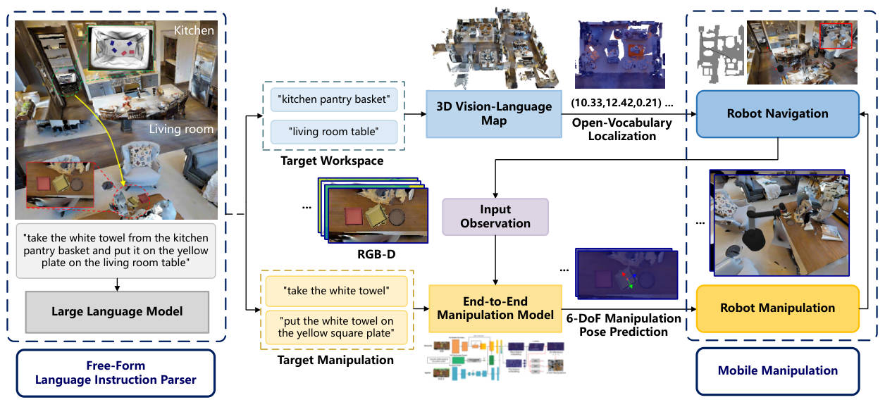
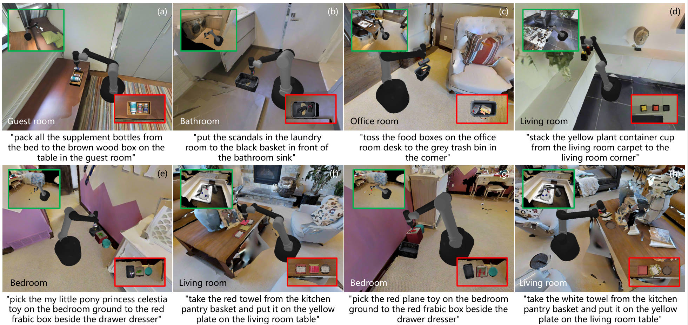

# LOVMM
This is the code and [supplementary material](media/LOVMM-appendix.pdf) for "**Language-Conditioned Open-Vocabulary Mobile Manipulation with Pretrained Models**", *International Joint Conference on Artificial Intelligence (IJCAI)*, 2025.

Open-vocabulary mobile manipulation (OVMM) that involves the handling of novel and unseen objects across different workspaces remains a significant challenge for real-world robotic applications. We propose a novel Language-conditioned Open-Vocabulary Mobile Manipulation framework, named LOVMM, incorporating the large language model (LLM) and vision-language model (VLM) to tackle various mobile manipulation tasks in household environments.



## Installation
LOVMM is built based on [CLIPort](https://github.com/cliport/cliport), please refer to the original installation guides.

## Pre-trained Checkpoints
Please contact the [author](shentan@stu.hit.edu.cn) for all pre-trained checkpoints.

## Dataset
We conduct large-scale experiments based on the [CLIPort](https://github.com/cliport/cliport) benchmark in simulated indoor household scenes for 16 OVMM tasks with over 35K steps of demonstrations. Folder [lovmm_data](lovmm_data) includes 5 task demonstrations for quick implementation, please contact the [author](shentan@stu.hit.edu.cn) for full dataset.


## Training and Evaluation
### Requirements

A single NVIDIA GPU with more than 16GB memory should be sufficient for training and evaluation (we use 8x NVIDIA 4090 to accelerate training).

Tested with:
- **GPU** - NVIDIA RTX 4090
- **OS** - Ubuntu 18.04

### Multi-task Training

You can specify training specs by using:
```bash
python lovmm/train.py train.task=multi-custom-seen-lovmm \
                        train.agent=lovmm \
                        train.attn_stream_fusion_type=add \
                        train.trans_stream_fusion_type=conv \
                        train.lang_fusion_type=mult \
                        train.n_demos=100 \
                        train.n_steps=601000 \
                        train.exp_folder=lovmm_exps \
                        dataset.type=multi
```
**Note**: For quick implementation, you should use ``train.n_demos=5``. Although LOVMM is not tested for single-task scenarios, you may train your own single-task model with only a few modifications.

### Evaluation

Our evaluation pipeline is built based on [Pybullet](https://pybullet.org/) and [Habitat 2.0](https://github.com/facebookresearch/habitat-sim/tree/v0.2.1). The source code will be available soon.


## Acknowledgements

This work use code from the following open-source projects and datasets:

### CLIPort
Original:  [https://github.com/cliport/cliport](https://github.com/cliport/cliport)  
License: [Apache 2.0](https://github.com/google-research/ravens/blob/master/LICENSE)    
Changes: All seen OVMM tasks use the same evaluation criteria as the original benchmark but with different objects.

### Google Scanned Objects

Original: [Dataset](https://app.ignitionrobotics.org/GoogleResearch/fuel/collections/Google%20Scanned%20Objects)  
License: [Creative Commons BY 4.0](https://creativecommons.org/licenses/by/4.0/)  
Changes: Fixed center-of-mass (COM) according to [CLIPort](https://github.com/cliport/cliport).

### Habitat 2.0
Original: [Habitat-Sim](https://github.com/facebookresearch/habitat-sim/tree/v0.2.1) 
License: [MIT License](https://github.com/facebookresearch/habitat-sim/blob/v0.2.1/LICENSE)